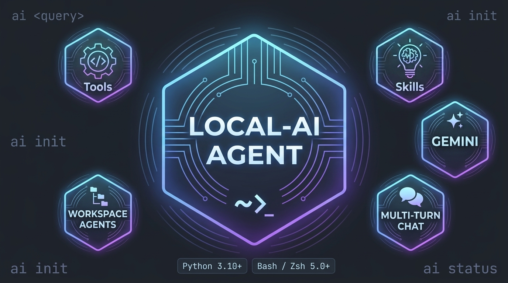

<p align="center">
  
</p>

<h1 align="center">Local-AI Agent <kbd>v0.9.5.2-beta</kbd></h1>

<p align="center">
  
  
  
</p>

<p align="center">
  <code>gpt</code> &nbsp; <code>claude</code> &nbsp; <code>grok</code> &nbsp; <code>gemini</code> &nbsp; <code>openrouter</code> &nbsp; <code>gguf</code>
</p>

---

<h2 align="center">Overview & Execution Modes</h2>

Built with zero context-stuffing for extreme efficiency on quantized local models (`Qwen-3.5-2B+`, `Gemma-4-E2B+`) and frontier cloud APIs.

- **Direct Shell Jaccard (`<shortcut>`):** Sub-millisecond keyword routing to local shell scripts via [`ai-context.md`](ai-context.md).
- **Single-Turn Query (`ai <query>`):** Instant response piped straight back to your shell prompt.
- **Multi-Turn Chat (`ai`):** Persistent interactive terminal session with memory context.
- **Workspace Agent (`ai init <path>`):** Full codebase graph indexing, editing tool-calling, and sub-agent concurrency.

---

<h2 align="center">Key Systems & Integrations</h2>

| Feature System | Foundation & Architectural Roots | Interface Command / Link |
| :--- | :--- | :--- |
| **Temporal Personality Memory (TPM)** | Reconciles personal identity & workspace habits using [Weaviate Engram](https://github.com/weaviate/engram-python-sdk) concepts + [Noema](https://github.com/Fail-Safe/Noema) Markdown files. | `.agent/tpm.md` |
| **Codebase Graph & Relational Index** | Structural codebase maps ([Graphify](https://github.com/Graphify-Labs/graphify)) + relational queries ([codebase-memory-mcp](https://github.com/DeusData/codebase-memory-mcp)) + [sqlite-vec](https://github.com/asg017/sqlite-vec) vector RAG. | `index-map <dir>` |
| **System Admin & Diagnostics** | Live health monitoring, AUR/security audits, system optimization, status routing, and git commit hooks. | [`/tools/agentic/system/`](/tools/agentic/system) |
| **Model Select TUI** | Real-time **[Cloud Connection](https://github.com/j5onrf/local-ai/blob/main/modules/Readme.md)** TUI, key toggles, and endpoint selector. | `model select` |
| **Interactive Textual TUI** | Full-screen, **[Textual](https://github.com/j5onrf/local-ai/blob/main/modules/Readme.md)** TUI workspace modeled after grok-build. | `/tui` |

---

---

<h2 align="center">CLI Launch Interfaces</h2>

<p align="center">
  Customize box themes <code>/box [1-5]</code>. For detailed multi-agent workflows, read the <a href="https://github.com/j5onrf/local-ai/blob/main/projects/Readme.md"><b>Workspace Manual</b></a>.
</p>

#### 1. Interactive Multi-Turn Chat (`ai`)
```console
~ ❯ ai
╔═  ❖ Local-AI Agent  ══════════════════════╗
║     model:  Qwen3.6-35B-A3B.gguf          ║
║ directory:  ~                             ║
║     skill:  default                       ║
║  database:  stateless                     ║
╚══════════════════════════ Ctrl+C to exit ═╝
 Startup context: 74 tokens
❯ 
```

#### 2. Workspace & Sub-Agent (`ai init <path>`)
```console
~ ❯ sess
[01/03] ❯ [session test] ai init ~/session-test --init
:: ↵ run  Esc: 
[1] 90031
✔ Mapping complete! [session-test index-map & SQLite graph database updated]
╭────────────────────────────────────────────────────────╮
│   >_ Local-AI Agent [sub-agent #1]                     │
│                                                        │
║     model:  Qwen3.6-35B-A3B.gguf                       │
│ directory:  ~/.config/local-ai/projects/session-test   │
│     skill:  init                                       │
│  database:  active (0 facts, 2 turns)                  │
╰─────────────────────────────────────── Ctrl+C to exit ─╯
 Startup context: 121 tokens

Agent: Workspace loaded. Awaiting instructions.

 [ 7 tokens | 0.28s | 28.23 t/s ]
 [ 703 in | 7 out | ctx: 8.7% ]
❯ 
```
---

<h2 align="center">Core Capabilities</h2>

| Core Module | Capability | Description |
| :--- | :--- | :--- |
| **Engine** | **Zero-Daemon** | 0% idle CPU/RAM usage. Native Python standard-library execution. |
| **Resilience** | **Provider Cascade** | Top-down `.env` fallback: Gemini $\rightarrow$ OpenRouter $\rightarrow$ OpenAI $\rightarrow$ Claude $\rightarrow$ Grok $\rightarrow$ Local GGUF. |
| **Multi-Agent** | **Subagents** | [Vercel Eve](https://github.com/vercel/eve)-style sub-agents with [herdr](https://github.com/ogulcancelik/herdr) multiplexing via (`-save`/`-load`). |
| **Safety** | **Zero-Trust Gates** | Mandatory approval prompts for commands and out-of-bounds file access. |
| **Validation** | **Type-Safe & AST Guard** | [Pydantic AI](https://github.com/pydantic/pydantic-ai) schemas + [OpenAI Agents](https://github.com/openai/openai-agents-python)-style self-correcting `.py`/`.json` writes. |
| **Optimization** | **Token-Slasher** | Custom [`tool`](https://github.com/j5onrf/fetch/tree/main/tools) and [`skill`](https://github.com/j5onrf/fetch/tree/main/skills) integration built for minimal token consumption. |

---

<h2 align="center">TUI Carousel & Input Controls</h2>

* **`Up` / `Down` Arrow Keys:** Cycle through ranked command choices.
* **`Enter`:**  Execute the highlighted command or enter directory.
* **`Esc` / `Right Arrow` / `Ctrl+C`:** Cancel/bypass active selection, memory-recall, or authorization prompt.

```console
~ ❯ weather
[01/02] ❯ [weather full] curl -s wttr.in | cat
:: ↵ run  Esc:
```
---

<h2 align="center">Command Reference</h2>

```text
╭─  ⚙ Help & Commands  ───────────────────────────────────────────────╮
│   Shortcuts: Esc: bypass  Ctrl+C: cancel                            │
│                                                                     │
│   Available commands:                                               │
│  /help, /h                   - Show help menu                       │
│  /box, /box-style            - Change CLI box style (1-5)           │
│  /t, /thinking [N|show|hide] - Set reasoning budget or show/hide    │
│  /g, /yolo                   - Toggle confirmation gates (YOLO)     │
│  /m                          - Toggle long-term memory              │
│  /stats                      - Toggle generation speed stats        │
│  /tok                        - Show context token usage             │
│  /sync, /re                  - Sync codebase AST & graph            │
│  /clear, /reset              - Clear chat history & memory          │
│  /spell, /sp                 - Toggle spellchecker                  │
│  /skill <q>, /s              - Search and load custom skills        │
│  /tui                        - Open full-screen Textual UI          │
│  -save <tag>                 - Save session checkpoint              │
│  -load, -timeline            - Load or clone checkpoint             │
│  /f, /tk, /b, /a             - Follow-up, Think, Brainstorm, All    │
│  view file <path>            - Load file into context               │
│  read function <sym>         - Load AST symbol snippet              │
│  exit, quit, q               - Exit Local-AI Agent                  │
╰─────────────────────────────────────────────────────────────────────╯
```

---

<h2 align="center">Agent Blueprint</h2>

Add your shortcuts, commands, and workspaces to [`ai-context.md`](https://github.com/j5onrf/local-ai/blob/main/ai-context.md).

```markdown
# --- Weather & Live Networking ---
[TOOL] curl -s wttr.in --cat ---> weather full, wttr, weather
[TOOL] curl -s "wttr.in/?format=3" --cat ---> weather simple, wttr, weather

# --- Local-Ai Agent Blueprint (CheatSheet) ---
~/.config/local-ai/tools/blueprint --leaf ---> cheatsheet, blueprint, bp, cs
```

---

<h2 align="center">Setup & Prerequisites</h2>

```bash
# 1. Install system dependencies
sudo pacman -S python-rich python-requests

# 2. (Optional) Install extensions (sqlite-vec for code search | textual for /tui)
yay -S python-sqlite-vec && sudo pacman -S python-textual

# 3. Clone repository & register shell environment hook
git clone https://github.com/j5onrf/local-ai.git ~/.config/local-ai && \
echo '[ -f "$HOME/.config/local-ai/ai-hook.sh" ] && source "$HOME/.config/local-ai/ai-hook.sh"' >> ~/.bashrc && \
source ~/.bashrc

# 4. Create your configuration file
nano ~/.config/local-ai/.env
```

#### Configuration Example (`~/.config/local-ai/.env`):

```env
# Top-Down Cascade Fallback Priority
GEMINI_API_KEY="AIzaSyYourGeminiKey"
GEMINI_MODEL="gemini-3.5-flash-lite"

OPENROUTER_API_KEY="sk-or-v1-YourOpenRouterKey"
OPENROUTER_MODEL="openrouter/free"

OPENAI_API_KEY="your-openai-key"
OPENAI_MODEL="gpt-5.6"

CLAUDE_API_KEY="your-claude-key"
CLAUDE_MODEL="claude-fable-5"

XAI_API_KEY="xai-your-grok-key"
XAI_MODEL="grok-4.5"

AI_MAX_TOKENS="8192"
```

---

<h2 align="center">Roadmap to v1.0.0</h2>

- [x] **Core Engine Optimization:** Production pass on streaming, token counting, and sub-agent concurrency.
- [x] **Thinking UI Controls:** Real-time thinking TPS metrics and `/r show|hide` panel toggles.
- [ ] **Modular Agent Personas & Tool Loop:** Interactive profile selector on `ai init` (`pi`, `claude`, `hermes`, `openclaw`) with automated file-editing & bash execution loops.
- [ ] **Context Stress Testing:** Continuous context-window pressure tests across quantized local engines.
- [ ] **Automated File Containment Validation:** Zero-trust security verification on traversal boundaries.
- [ ] **v1.0.0 Production Release Tag!**

---

## License & Credits

* **License:** Licensed under the **[GNU AGPL-3.0 License](LICENSE)**.
* **Contributions:** [suyadnya](https://github.com/wibawasuyadnya) for `.env` fallback architecture, macOS compatibility testing, and alias optimization.
