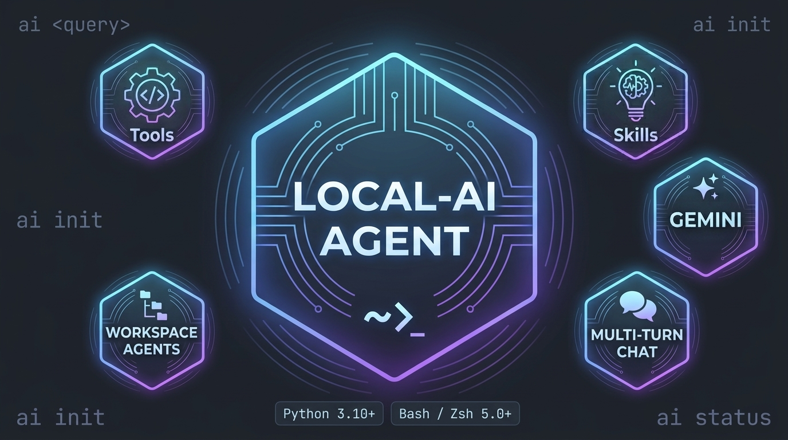

<div align="center">
    
</div>

<h1 align="center">Local-AI Agent <kbd>v0.9.8.53-beta</kbd></h1>

<p align="center">
  
  
  
</p>

<p align="center">
  <code>gpt</code> &nbsp; <code>claude</code> &nbsp; <code>grok</code> &nbsp; <code>gemini</code> &nbsp; <code>openrouter</code> &nbsp; <code>custom-hf</code> &nbsp; <code>gguf</code>
</p>

---

## Overview & Execution Modes

Lightweight Python orchestration (`rich` + `requests` + `sqlite-vec` + `uvloop`) controlling a C++ backend (`llama-server`). Built for extreme efficiency on quantized local models (`LFM2.5-8B-A1B+`, `Qwen-3.5-2B+`, `Qwen3.6-35B-A3B+`) and cloud provider cascades. Active: Dedicated HF endpoint (`Qwen/Qwen3.8-27B`).

- **Direct Shell Jaccard (`<shortcut>`):** Sub-millisecond keyword routing to local shell scripts via [`ai-context.md`](ai-context.md).
- **Single-Turn Query (`ai <query>`):** Instant response piped straight back to your active shell prompt.
- **Multi-Turn Chat (`ai`):** Persistent interactive terminal session with memory context.
- **Workspace Agent (`ai init <path>`):** Full codebase graph indexing, path-healing file editing, and sub-agent concurrency.

---

## Key Systems & Integrations

| Feature System | Foundation & Architectural Roots | Interface Command / Link |
| :--- | :--- | :--- |
| **Temporal Personality Memory (TPM)** | Reconciles personal identity & workspace habits using [Weaviate Engram](https://github.com/weaviate/engram-python-sdk) concepts + [Noema](https://github.com/Fail-Safe/Noema) Markdown files. | `.agent/tpm.md` |
| **Codebase Graph & Relational Index** | Structural codebase maps ([Graphify](https://github.com/Graphify-Labs/graphify)) + relational queries ([codebase-memory-mcp](https://github.com/DeusData/codebase-memory-mcp)) + [sqlite-vec](https://github.com/asg017/sqlite-vec) vector RAG with class inheritance graph mapping. | `index-map <dir>` |
| **Ralph Autonomous Task Loop** | Self-directed iteration loop ([Ralph Wiggum](https://github.com/ghuntley/how-to-ralph-wiggum)) executing tasks against project specs (`TASK.md`) until verified complete. | `/task [goal]` |
| **NOOA IPython Kernel Harness** | NVIDIA Object-Oriented Agent ([NOOA](https://github.com/NVIDIA-NeMo/labs-OO-Agents) + [Prime Agent](https://github.com/PrimeIntellect-ai/prime-agent)) stateful Python kernel with pass-by-reference bounded previews (`preview()`), model-callable `memory`/`graph` APIs, and in-kernel `delegate()` sub-agents. | `/py` |
| **DeepSeek Session Audit & IPC** | Structured JSONL session event logs + JSON-RPC 2.0 socket IPC + YAML skill frontmatter overlays inspired by [DeepSeek Harness](https://github.com/deepseek-ai/deepseek-harness). | `.agent/session.jsonl` |
| **Reasonix Cognitive Engine** | Real-time reasoning trace step extraction ([Reasonix](https://github.com/esengine/deepseek-reasonix)) + cognitive phase formatting inside thinking stream. | `/t [N\|show\|hide]` |
| **System Admin & Diagnostics** | Live health monitoring, AUR/security audits, system optimization, status routing, and git commit hooks. | [`tools/agentic/system/`](tools/agentic/system) |
| **Model Select TUI** | Real-time **[Cloud Connection](modules/Readme.md)** TUI, key toggles, and endpoint selector. | `model select` |
| **Interactive Textual TUI** | Full-screen **[Textual](modules/Readme.md)** TUI workspace with JSON-RPC 2.0 sub-agent socket IPC powered by a C-speed `uvloop` event loop. | `/tui` |

---

## Core Capabilities

| Core Module | Capability | Description |
| :--- | :--- | :--- |
| **Engine** | **Zero-Daemon** | 0% idle CPU/RAM usage. Native Python standard-library execution. |
| **Resilience** | **Provider Cascade** | Top-down `.env` fallback: Custom Endpoints / HF $\rightarrow$ Gemini $\rightarrow$ OpenRouter $\rightarrow$ OpenAI $\rightarrow$ Claude $\rightarrow$ Grok $\rightarrow$ Local GGUF. |
| **Multi-Agent** | **Subagents** | [Vercel Eve](https://github.com/vercel/eve)-style sub-agents with [herdr](https://github.com/ogulcancelik/herdr) multiplexing (`-save`/`-load`) + in-kernel `delegate("goal")` sub-loops. |
| **Safety** | **Zero-Trust Gates** | Mandatory approval prompts for commands and out-of-bounds file access. |
| **Validation** | **Type-Safe & AST Guard** | [Pydantic AI](https://github.com/pydantic/pydantic-ai) schemas + [OpenAI Agents](https://github.com/openai/openai-agents-python)-style self-correcting `.py`/`.json` writes. |
| **Optimization** | **Token-Slasher** | Custom [`tools/`](tools/) and [`skills/`](skills/) integration built for minimal token consumption. |
| **Voice-to-Text** | **Tablet/Phone Bridge** | Zero-latency HTTPS voice bridge with Gemini cloud audio transcription (`/v [auto]`). |
| **Text-to-Speech** | **Neural Kokoro TTS** | Local PipeWire audio reader (`/tts`) using `koko` with automatic code/thinking filtering. |

---

## CLI Launch Interface

> Customize box themes with `/box [1-5]`. For detailed multi-agent workflows, read the [**Workspace Manual**](https://github.com/j5onrf/local-ai/blob/main/projects/Readme.md).

#### 1. Interactive Multi-Turn Chat (`ai`)
    
```console
~ ❯ ai
╭─  >_ Local-AI Agent  ─────────────╮
│     model:  Qwen3.6-35B-A3B.gguf  │
│ directory:  ~                     │
│     skill:  chat                  │
│  database:  stateless             │
╰────────────────── Ctrl+C to exit ─╯
 Startup context: 103 tokens
❯ 
```

#### 2. Workspace & Sub-Agent (`ai init <path>`)

```console
~ ❯ sess
[01/03] ❯ [session test] ai init ~/session-test --init
:: ↵ run  Esc: 
✔ Mapping complete! [session-test index-map & SQLite graph database updated]
╭────────────────────────────────────────────────────────╮
│   >_ Local-AI Agent [sub-agent #1]                     │
│                                                        │
│     model:  Qwen3.6-35B-A3B.gguf                       │
│ directory:  ~/.config/local-ai/projects/session-test   │
│     skill:  hermes/pro                                 │
│  database:  active (0 facts, 2 turns)                  │
╰─────────────────────────────────────── Ctrl+C to exit ─╯
 Startup context: 195 tokens

Agent: Workspace loaded. Awaiting instructions.
❯ 
```

---

## Interactive Textual TUI

<div align="center">
  <kbd>
    
  </kbd>
</div>

---

## Setup & Installation

```bash
# 1. Install system dependencies
sudo pacman -S python-rich python-requests

# 2. (Optional Extensions) Ultra-fast /tui and vector search
yay -S python-sqlite-vec && sudo pacman -S python-textual python-uvloop

# 3. Clone repository
git clone https://github.com/j5onrf/local-ai.git ~/.config/local-ai

# 4. Register shell environment hook
echo '[ -f "$HOME/.config/local-ai/ai-hook.sh" ] && \
source "$HOME/.config/local-ai/ai-hook.sh"' >> ~/.bashrc
source ~/.bashrc

# 5. Create your configuration file
nano ~/.config/local-ai/.env
```

#### Configuration Example (`~/.config/local-ai/.env`):

<kbd>

```env
# Top-Down Cascade Fallback Priority
CUSTOM_API_KEY="none"
CUSTOM_URL="https://.../v1/chat/completions"
CUSTOM_MODEL="default"

GEMINI_API_KEY="AIzaSyYourGeminiKey"
GEMINI_MODEL="gemini-3.5-flash-lite"

OPENROUTER_API_KEY="sk-or-v1-YourOpenRouterKey"
OPENROUTER_MODEL="openrouter/free"

OPENAI_API_KEY="your-openai-key"
OPENAI_MODEL="gpt-5.6"

CLAUDE_API_KEY="your-claude-key"
CLAUDE_MODEL="claude-opus-5"

XAI_API_KEY="xai-your-grok-key"
XAI_MODEL="grok-4.5"

AI_MAX_TOKENS="8192"
```
</kbd>

---

## Roadmap to v1.0.0

- [x] **Core Engine Optimization:** Production pass on streaming, token counting, and sub-agent concurrency.
- [x] **Thinking UI Controls:** Real-time thinking TPS metrics and `/t show|hide` panel toggles.
- [x] **Modular Agent Personas & Tool Loop:** Interactive profile selector on `ai init` (`pi`, `claude`, `hermes`) with automated path-healing file editing & YOLO execution loops.
- [x] **Textual Async TUI:** Sub-millisecond `uvloop` event loop integration, Unix socket sub-agent hub, and live workspace watchers.
- [x] **Reasonix Cognitive Step:** Real-time reasoning cognitive transition extraction, real-time thinking step formatting, and stream interception.
- [x] **Ralph Autonomous Task Loop:** On-demand `while` loop engine (`/task`, `TASK.md`) with automated completion verification.
- [x] **Voice to Text:** Low-latency HTTPS tablet or phone voice bridge, Gemini cloud transcription, and non-blocking stdin injection loop (`/v [auto]`).
- [x] **Kokoro Neural Text-to-Speech:** Real-time local neural voice reader (`/tts`), PipeWire audio integration, and automatic thinking/code block filtering.
- [x] **NOOA IPython Kernel Harness:** Single-tool Python kernel execution engine (`/py`) with NVIDIA NOOA bounded previews (`preview()`), model-callable `memory`/`graph` APIs, in-kernel `delegate()` sub-agents, AST safety gates, and stateful context token conservation.
- [x] **DeepSeek Session Audit & IPC:** Real-time JSONL event logging (`.agent/session.jsonl`), JSON-RPC 2.0 sub-agent socket IPC, and YAML skill profile frontmatter headers.
- [ ] **Context Stress Testing:** Continuous context-window pressure tests across quantized local engines.
- [ ] **Automated File Containment Validation:** Zero-trust security verification on traversal boundaries.
- [ ] **v1.0.0 Production Release Tag!**
  
---

## Credits

*   **License**: Licensed under the permissive [MODIFIED MIT LICENSE](LICENSE).
*   **Community:** Contributions are always welcome!
